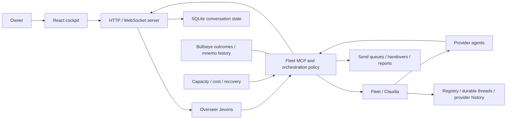

# Jevons: daily-driver readiness and development review

Assessment date: 5 September 2026. This is an assessment, not a release certification or an implementation plan already authorized for execution.

## Executive assessment

Jevons has become a substantial, useful orchestration system. The durable-agent foundation, unified addressing, provider abstraction, cost controls, recovery machinery, and React cockpit are real. It is well beyond a demonstration of agents spawning agents.

I would nevertheless not yet rely on it as the sole system of record for work delegated to a fleet. Its central unresolved problem is disagreement between layers: an accepted message and a delivered message; a registered agent and a usable process; a finished report and an accepted result; a ledger achievement and a landed change; a tested checkout and the running product. Recent development has repaired many instances of these disagreements without yet closing their underlying classes.

The most valuable next investment is a period of consolidation around one dependable owner-to-overseer-to-worker-to-result loop. More agent types, background activity, generated interfaces, and provider breadth would increase the number of combinations that must be trusted before addressing this bottleneck.

There is no defensible percentage-complete estimate. Personal daily-driver readiness is also narrower than the stranger-ready product described by 🎯T48: mobile onboarding, public distribution, voice, and the broader provider hub need not all finish before this owner can depend on Jevons.

### Scope and provenance

- Committed baseline: local `master`, `8dd6e1694bbfb9ca1ac335f2c2d6ca939ce30fab`, dated 2 September. Tests used an isolated clean checkout, `GOWORK=off`, and the committed dependency pin, excluding sibling-repository overrides.
- Current work was inspected separately. At entry, the shared checkout contained 42 modified tracked files, plus untracked implementation/tests and other artifacts. These changes were not silently counted as landed or included in baseline test results.
- Development was inspected read-only at `http://localhost:13705/`: browser render, health, and capacity. No owner prompt was submitted there, no development fleet was changed, and no daemon was restarted.
- Historical evidence: HEAD ancestry and changed-path history; selected mnemo sessions/searches; the repository's February–August synthesis, charter, architecture, incident reviews, and target acceptance/attestations. The synthesis is secondary evidence, not an independently verified census of every conversation. Mnemo search can label captured tool output as user text; those hits were not treated as owner statements.
- This is a broad structural and readiness review, with deeper tracing of delivery, persistence, lifecycle, provider migration, UI serving, verification, and authority. It is not an exhaustive line-by-line review, penetration test, mobile test, race audit, or 30-day reliability study.
- Production source and pre-existing work were preserved. New findings 🎯T623–🎯T625 were recorded for design discussion, without starting implementation.

## How the project reached this point

HEAD has 817 commits: February 2, March 37, April 13, May 2, June 1, July 39, August 712, and September 11. These are commit counts, not effort, feature, or quality measurements. Counts follow HEAD ancestry, rather than every local reference. The latest reachable release tag is `v0.13.0` on 9 August; 712 commits follow it. This establishes a large release-to-development gap, not whether every later commit has been pushed.

| Period | Development direction | What it means now |
|---|---|---|
| February–March | Remote coordination, web interaction, persistent asynchronous agents | The product began as a way to reach and control agents, rather than as a complete work-management system. |
| April–June | Voice/mobile exploration, with much less committed activity | Those ambitions expanded the design surface without settling the core daily loop. They are not today's personal-readiness prerequisite. |
| July | A narrower CEO/butler model, durable threads, delegation, provider and cost work | The central architecture took recognizable shape. The 6 July incident involving 47 detached sessions made bounded operation a concrete requirement. |
| Early/mid August | Intensive use and self-development, followed by delivery, process, supervisor, resource, and verification repairs | Jevons acquired substantial real-world hardening. The history also repeatedly shows the owner discovering gaps that nominally green checks did not decide. |
| Late August–early September | React cutover, SQLite conversation state, provider/session migration and continuing repair of core chat/fleet semantics | These are worthwhile architectural changes, but several foundations are migrating simultaneously. Integration confidence has not caught up with implementation volume. |

The recurring pattern is particularly informative. Shared-file overwrites led to tree guards; shared-index contamination led to commit scoping; stale private-index bases led to another guard. False test greens led to the gate wrapper and then checks on gate claims. A missing supervisor led to supervision of the supervisor. Delivery confirmation was separated from transport return values, then backlog recovery and compaction introduced further cases. This is learning backed by specific incidents, not random feature churn. But a growing collection of repair-specific rules is not equivalent to a small set of enforced system invariants.

The [July runaway review](/Users/marcelo/work/github.com/marcelocantos/jevons/docs/analysis/postmortem-token-runaway-2026-07-06.md) and the August RAM/ghost-fleet history both concern resources escaping the owner's mental model. Current capacity and cost controls are an important response. Historical price-equivalent estimates are not treated here as invoices or measured financial loss.

The [development history](/Users/marcelo/work/github.com/marcelocantos/jevons/docs/history.md) is a useful narrative. Its existence does not settle readiness; the fresh failures and code paths below do.

## Observed architecture and dimension vector

The owner normally uses React over `/ws/mux`. `internal/server` handles conversation serving, journaling, projections, owner health, and delivery into the overseer. `internal/mcpserver` exposes fleet tools and contains much of the orchestration and recovery policy. `internal/fleet` and Claudia handle actual provider processes and sessions; durable threads, registry records, handovers, queues, and provider transcripts surround that process layer. Bullseye records intended outcomes; mnemo provides history. Cost, capacity, supervision, and background loops act across this graph.

This is not intrinsically the wrong architecture. It does, however, have more durable and inferred representations of work than the phrase “one durable spine” suggests. `mcpserver` and `server` are the principal coordination hubs. A textual census of non-test Go files at HEAD found approximately 27,000 and 16,900 lines respectively, including comments; they import 51 and 36 distinct internal packages. Size alone is not a defect. The actionable issue is that changes to provider events or delivery semantics propagate through these hubs into several state and recovery models.

| Dimension | State | Evidence |
|---|---|---|
| Architecture topology | Concern | Useful provider/process seams, but orchestration policy is concentrated in broad MCP/server hubs. |
| Sources of truth | Critical | Accepted-message drain is not transactional; conversation and migration readers are still being converged. |
| Change amplification | Critical | Shared checkout incidents recur; 42 modified tracked files at entry and several uncommitted lifecycle changes. |
| Local code quality | Concern | Many clear pure policy helpers and explicit errors; also repair-specific string classifiers and accumulating compatibility branches. |
| Correctness / verification | Critical | Clean Go suite and declared React production build are red; important journeys accept weaker outcomes than their names suggest. |
| Security / dependencies | Concern | Loopback/CSRF/origin safeguards exist, but agents remain highly trusted and caller identity is self-attested. No comprehensive security audit performed. |
| Build / release / operations | Critical | React is external to the binary; release packaging and development fallback do not guarantee one verified artifact. Diagnostic memory bypass is currently enabled. |
| Documentation / governance | Concern | Specific useful doctrine, but architecture, ledger, and build claims disagree with observed code and commit state. |

No scalar is derived from these states. “Critical” means consequential to the requested reliability goal, not evidence of a current outage in every dimension.

## Findings

### ENT-001 — Accepted work can leave durable storage before delivery is resolved

**Priority P1. Status: observed code mechanism; production loss not reproduced in this audit. Dimensions: correctness, sources of truth.**

[`sendq.PopFront`](/Users/marcelo/work/github.com/marcelocantos/jevons/internal/sendq/sendq.go:275) saves removal before returning an entry. [`drainAgentSendQueue`](/Users/marcelo/work/github.com/marcelocantos/jevons/internal/mcpserver/agent_send.go:627) calls it before sending. A daemon death between those operations leaves no queued obligation to replay. A send error classified as definite non-delivery returns at line 668 after logging, without restoring the entry or recording a sender-visible terminal outcome. Separately, the overseer's [`notifyQueue`](/Users/marcelo/work/github.com/marcelocantos/jevons/internal/server/server.go:194) is in memory.

**Counterevidence:** durable queue files, requeue-on-busy/dead-process branches, receiver-side delivery evidence, saved full worker reports, backlog sweeps, and 🎯T418 journeys all exist. They prevent important classes of loss. Saved reports can preserve content without preserving the obligation to deliver it. The cited bounce journeys prove a held queue is re-offered, not that every drain transition survives death.

**Consequence:** the system can remember that work existed while losing responsibility for getting it to the intended recipient. This directly undermines “tell Jevons once, then trust it.”

**Smallest coherent remediation:** durable pending/in-flight/terminal delivery records with message identity, receiver evidence, and explicit uncertain outcomes. A definite failure must retain the message or surface a durable failure. Do not promise exactly-once arbitrary agent execution or blindly resend ambiguous deliveries.

**Verification/ratchet:** kill the daemon at each acceptance/drain/submit/ack transition; invoke the real drain on definite and ambiguous send errors; assert every accepted ID is delivered, still recoverable, or visibly failed. Include the overseer's notifications. Track: **🎯T623**, related to achieved 🎯T418.

### ENT-002 — Development isolation and artifact identity are incomplete

**Priority P1. Status: observed implementation and historical incidents; concurrent corruption not induced. Dimensions: change amplification, operations.**

Treeguard, scoped commits, and commitbase are good defenses against specific shared-checkout races. They do not give workers isolated source trees, dependencies, or test inputs. 🎯T254.2 records recent cases of tests being removed between verification and commit and foreign hunks in shared files. The current checkout again contains broad concurrent work.

The [restart path](/Users/marcelo/work/github.com/marcelocantos/jevons/scripts/restart-daily-jevonsd.sh:705) builds React from a committed snapshot, which is a substantial improvement. It then copies assets into shared `ui/dist`; on UI build failure it deliberately keeps existing assets. The resulting backend/frontend pair need not represent the same revision. The [release workflow](/Users/marcelo/work/github.com/marcelocantos/jevons/.github/workflows/release.yml:45) archives only `jevonsd`, while [default-port serving requires external React assets](/Users/marcelo/work/github.com/marcelocantos/jevons/internal/server/react_ui.go:53). A standalone package built by that workflow does not include the current canonical cockpit. This is a packaging gap for current HEAD, not a claim that the pre-React v0.13 release had the same requirement.

**Counterevidence:** clean-checkout build gates, snapshot compilation, publishable dependency pins, and refusal to silently substitute vanilla on the development port all reduce risk. The development cockpit does currently render.

**Smallest coherent remediation:** isolated checkout per implementation worker, a single integration owner, and immutable versioned daemon-plus-UI artifacts activated as a pair. Keep the previous complete artifact available for rollback. Expose its revision in the product. This does not require implementing the entire parked factory vision.

**Verification/ratchet:** two concurrent workers cannot change each other's test inputs; a clean package starts the React cockpit; a failed candidate build leaves the previous complete artifact serving; restarting preserves accepted work. Existing targets: **🎯T254.2, 🎯T505, 🎯T553.1, 🎯T47**.

### ENT-003 — Fresh gates disagree with the completion story

**Priority P1. Status: directly reproduced. Dimensions: correctness, build, governance.**

The full clean Go suite fails `TestT446MetaMentionReportReaps`; three isolated repeats also fail. The log names `false_green_attestation_unknown`, while the test expects the finished worker to be removed. This is a conflict between a fixture's expected lifecycle and later evidence enforcement. It is not sufficient evidence that all genuine completed workers currently leak. It is sufficient evidence that the accepted baseline is red and two rules are not reconciled. **🎯T604** already tracks the clean Go baseline.

React's `npm test` passes 321 tests with 49 skipped. Its `npm run build` fails TypeScript checking in `AgentTranscript`, `PlanUsageBar`, `rowModel`, and several helpers. The actual `make ui-build` Vite-only serving path passes. [The Makefile](/Users/marcelo/work/github.com/marcelocantos/jevons/Makefile:280) says type checking remains on `npm test`, but [that script](/Users/marcelo/work/github.com/marcelocantos/jevons/ui/package.json:10) runs Vitest only. **🎯T624** records this separate build-contract gap.

The [CI workflow](/Users/marcelo/work/github.com/marcelocantos/jevons/.github/workflows/ci.yml:11) runs Go build/vet/test on Ubuntu. It does not exercise the React build, browser suites, or live provider journeys required by the repository's full `make test` contract.

**Counterevidence:** many substantial tests pass, and the gate wrapper correctly reports failures. The problem is not an absence of testing; it is accepting narrower greens as evidence for a larger product claim.

**Smallest coherent remediation:** restore a coherent baseline, make the canonical build part of acceptance, and distinguish fast local serving from verified product artifacts. Reconcile the reaping fixture against intended semantics; do not simply weaken evidence enforcement to make it pass.

**Verification/ratchet:** the complete standing net runs on an isolated committed artifact, with explicit provider-outage outcomes. A deliberate type error or missing product layer cannot yield a product green.

### ENT-004 — Some journeys do not decide the behavior their names imply

**Priority P1. Status: observed test logic. Dimensions: verification, governance.**

[`J2-chat-round-trip`](/Users/marcelo/work/github.com/marcelocantos/jevons/scripts/journey-suite/main.go:360) asks for a unique token but deliberately accepts a terminal response without that token. [`J9-thread-spawn-direct`](/Users/marcelo/work/github.com/marcelocantos/jevons/scripts/journey-suite/orchestration.go:360) similarly accepts any nonempty response. [`J6c-overseer-tools-attached`](/Users/marcelo/work/github.com/marcelocantos/jevons/scripts/journey-suite/orchestration.go:34) checks reply text for the overseer's name, not independent evidence that the requested tool was called. [`J14-bounce-resume`](/Users/marcelo/work/github.com/marcelocantos/jevons/scripts/journey-suite/bounce.go:140) compares session IDs and handover files after restart without requiring a successful post-bounce agent turn.

These checks have value as transport and metadata smoke tests. They do not establish request/reply correlation, working tools, or usable recovered cognition. In particular, a green bounce check is not enough to tell the owner that work can resume.

The fresh Cursor run also demonstrated the opposite error: a **false negative**. The product SQLite journal recorded the requested `journey-ping-1010` owner message at 09:36:50.336 UTC and the exact assistant answer with `end_turn` at 09:37:03.104 UTC, about 13 seconds later. Nevertheless J2 timed out after 90 seconds. The mechanism is visible: [`chatUserEchoAs`](/Users/marcelo/work/github.com/marcelocantos/jevons/internal/server/chat_wire.go:469) emits typed content blocks, whereas [`waitTurn`](/Users/marcelo/work/github.com/marcelocantos/jevons/scripts/journey-suite/main.go:607) recognizes a user echo only when content is a string. It then ignores assistant turns until that echo is recognized. The agent did answer; the acceptance reader is stale. This must not be presented as a Cursor chat outage.

**Counterevidence:** other journeys, such as J10's worker-created marker file, use independent machine-observable effects. The suite also has valuable port-ownership and cleanup protections. React's close-map work explicitly acknowledges the danger of counting assigned/skipped checks as completed coverage. The 233 close-map entries (130 skip, 89 hermetic, 10 journey, 4 mapper) are assignments, not a count of missing features; several skips are deliberate.

**Smallest coherent remediation:** make each critical journey decide its named property using fresh correlation IDs, independent tool effects, and a post-recovery action. Keep transport-only smoke tests, but label their evidence accordingly. Bind required journeys to the canonical React surface and selected supported providers.

The fresh run also exposed a provider-selection mismatch: `-provider grok` started the overseer on Grok, but J9's worker ran on Claude because plan-headroom routing overrode the configured choice. Its success is evidence for that actual Claude thread path, not a successful Grok worker journey. The suite's declared whole-isolate provider contract needs to match the routing it exercises.

**Verification/ratchet:** wrong-request replies, a fabricated tool answer, and a process that retains its session ID but cannot act must each fail. Track: **🎯T625**, related to **🎯T419, 🎯T540.7, 🎯T616**, and the CEO-loop requirement in **🎯T48**.

### ENT-005 — Recovery still infers obligations from prose and several partial state models

**Priority P1. Status: observed architecture; architectural recommendation is inference. Dimensions: sources of truth, change amplification.**

Open-intent extraction, owner health, idle nudges, report classifiers, frontier consumption, handover recovery, and provider transcript interpretation all attempt to recover what an agent should do next. The late-August SQLite/open-intent repairs and the uncommitted logical-history/migration work show these models still converging. A substantive reply, a completed turn, and a completed mission are different facts.

**Counterevidence:** typed envelopes, send outcomes, SQLite state, durable reports, target IDs, and handover records already supply much of the vocabulary needed. Deterministic repair loops are better than hoping another awake agent notices a failure. Not every string classifier should be replaced; classification is appropriate at the boundary of provider prose.

**Smallest coherent remediation:** carry explicit obligations through the existing system: request ID, responsible agent, accepted/active/blocked/awaiting-answer/verified-result state, next recovery action, and evidence. Derive cockpit status and recovery scheduling from those records. Use prose interpretation to populate or question records, rather than letting several loops independently decide whether the same obligation is open.

This includes the missing first-class owner-question lifecycle in **🎯T404** and structured work/inbox state in **🎯T254.3–🎯T254.4**. A question should remain visible and route its answer to the right agent after restart. Safe defaults can be explicit policy; silence must not manufacture authorization for actions requiring approval.

**Verification/ratchet:** an owner request survives restart and provider replacement with one accountable next action; a delayed reply cannot close a newer request; a worker question is neither reaped as completion nor lost in conversation history. Confirm through a whole-product journey, not solely a classifier test.

### ENT-006 — The CEO constitution is stronger than its enforced authority boundaries

**Priority P1 for broader unattended autonomy; P2 within the current trusted local operating model. Status: observed and documented residual. Dimensions: security, governance.**

The charter's separation of worker execution, independent attestation, CEO arbitration, and owner ratification is a sound destination. Today important portions remain instructions. [Fleet caller identity is self-attested](/Users/marcelo/work/github.com/marcelocantos/jevons/internal/mcpserver/deliver_policy.go:41). An agent can name another actor over the shared MCP transport. The auditor's read-only role is not a hard filesystem boundary. [`doit.GateSpawn`](/Users/marcelo/work/github.com/marcelocantos/jevons/internal/doit/engine.go:114) is a limited `jwork` dispatch check, not mandatory mediation of every named worker action; an absent engine allows dispatch.

**Counterevidence:** owner-origin messages are restricted, lineage-sensitive destructive operations exist, and default loopback binding plus browser-origin/CSRF controls matter. Peer messaging is intentionally permitted; it is not itself a defect. Full worker sandboxing was explicitly deferred in the milestone, so this is not an undisclosed failure of an implemented guarantee.

**Smallest coherent remediation:** state the trusted-local envelope clearly, then enforce the few boundaries that make a single CEO safe: provider/session-bound caller identity, read-only independent reviewers, explicit authority for external writes, and a stop path outside the overseer's own conversation. Avoid adding approval ceremony to routine reversible work.

**Verification/ratchet:** a worker cannot impersonate the CEO, an auditor cannot mutate the artifact it attests, and owner-required publication cannot be enabled by worker prose. Existing scope: **🎯T511, 🎯T536.2** and documented execution-gating follow-up. This audit did not attempt exploitation or certify host isolation.

### ENT-007 — A diagnostic capacity bypass remains active

**Priority P2. Status: directly observed runtime configuration. Dimensions: operations, governance.**

Development `/api/capacity` reported `policy.memory_gate_off: true` on 5 September. The [policy's own documentation](/Users/marcelo/work/github.com/marcelocantos/jevons/internal/capacity/policy.go:58) says this removes memory as a spawn/admission constraint, is for diagnosis, and is meant to be turned off again. The same snapshot showed normal kernel pressure and ample free memory: this is not evidence of a current memory emergency. Seat and other controls remain separate.

**Counterevidence:** the bypass was intentionally introduced for a real diagnosis (🎯T589), and other capacity controls are active. The unresolved question is whether that diagnostic experiment remains intentional, not whether the flag should never exist.

**Smallest coherent remediation:** conclude or explicitly retain the experiment, with an owner-visible status and expiry/review condition. Retention is a risk decision; do not silently change it during an audit.

**Verification/ratchet:** effective controls and active overrides are visible independently of agent narration, and an expired override cannot silently persist. This is an operational disposition against **🎯T589 / 🎯T566.2 / 🎯T573**, not a claim that the earlier fixes never worked.

### ENT-008 — Ledger and documentation are ahead of some landed facts

**Priority P2. Status: observed drift. Dimensions: documentation, governance.**

At entry Bullseye reported 785 targets: 81 active, 631 achieved, 73 set aside. Its validation also reported **🎯T553.2 achieved while 🎯T553.1 remains an open dependency**. The later count includes this audit's three new targets.

**🎯T621 and 🎯T622 were marked achieved on 3 September**, while the logical transcript implementation, migration integration, tests, and Claudia 0.30 pin are still modifications/untracked files relative to HEAD. Their attestations cite hermetic gates. That work may be useful and may pass those gates; it is not in the committed baseline audited here.

The architecture document's persistence table still identifies the owner JSONL journal as the durable conversation record, whereas [`main`](/Users/marcelo/work/github.com/marcelocantos/jevons/cmd/jevonsd/main.go:288) opens the product SQLite store and [`persistChatLine`](/Users/marcelo/work/github.com/marcelocantos/jevons/internal/server/chat.go:1486) takes the SQLite path. The document also states supervisord owns the daemon while the instructions/Makefile retain launchd until takeover. Runtime ownership was not independently certified here, so the contradiction remains a documentation finding rather than a claim about which process manager currently owns it.

**Counterevidence:** the ledger contains unusually candid incident evidence and residuals, and newer documents explicitly distinguish development from released. A ledger achievement is still a recorded claim, not a proof engine.

**Smallest coherent remediation:** attach achieved claims to landed revisions and applicable running-surface evidence; enforce graph validity; document one current persistence and supervision model. Keep future designs clearly separate.

**Verification/ratchet:** an achieved target with an open dependency fails validation; a stated landed implementation resolves in the claimed commit; architecture examples are checked against actual bootstrap/read paths. Do not make an achievement count the daily-driver acceptance metric.

## Healthy structure worth preserving

- Durable thread/process separation is the right foundation. Treating processes as replaceable while preserving named ownership and provider session identity remains valuable.
- A common fleet delivery boundary and explicit owner/agent origins reduce accidental alternate paths. Synchronous thread request/reply legitimately stays distinct: subscribing before send prevents losing the beginning of a reply.
- Receiver-side evidence is better than trusting a terminal driver's return code. The distinction between definite non-delivery and uncertain observation is correct and must survive queue repairs.
- Full reports are retained even when notification payloads are shortened. This protects forensic recovery and avoids making the chat window the only evidence store.
- Cost collection, policy, and provider actions have meaningful seams. Subscription price-equivalent usage is not silently treated as billable spend.
- Clean-checkout checks, commit scoping, atomic durable writes, gate-record verification, and isolated journey cleanup are useful defenses grounded in actual failures.
- React plus a server-owned conversation model is a reasonable consolidation direction. The vanilla implementation has value as a temporary parity reference, not a permanent second product.

These strengths argue for incremental convergence, not a rewrite.

## Fresh verification and hygiene posture

Gate records and raw outputs are under `/private/tmp/jevons-audit-20260905/gates/`; scratch material is deliberately outside the repository. The IDs below record the results without copying provider logs or credentials into this report.

| Check at clean HEAD | Result | Evidence |
|---|---|---|
| `go build -p 2 ./...` | Passed | `GATE audit-head-build exit=0 GREEN id=59787f26` |
| Full `go test -p 2 -count=1 -timeout 10m ./...` | Failed | `GATE audit-head-go exit=1 RED id=b29731ec`; T446 reaping fixture |
| Reaping test, three repeats | Failed each repeat | `GATE audit-head-reap-repeat exit=1 RED id=fba464f7` |
| `make test-web` | Passed | `GATE audit-head-web exit=0 GREEN id=c8d43694` |
| React `npm test` | 321 passed, 49 skipped | `GATE audit-head-react-tests exit=0 GREEN id=8d047d86` |
| React `npm run build` | Failed TypeScript checking | `GATE audit-head-react-build exit=2 RED id=656c3304` |
| Actual serving build, `make ui-build` | Passed | `GATE audit-head-vite-serving-build exit=0 GREEN id=703996f0` |
| Isolate daemon binary | Built | `GATE audit-head-journey-binary exit=0 GREEN id=a1b30f93` |
| Selected journeys, requested Grok | 3 failed, 1 passed on Claude | `GATE audit-head-isolate-grok exit=1 RED id=2963208e` |
| Selected journeys, requested Cursor | 2 failed checks, bounce metadata passed | `GATE audit-head-isolate-cursor exit=1 RED id=06d29825` |
| Cursor actual chat outcome, read from product SQLite | Exact requested answer observed after about 13 seconds | Fresh nonce in owner and assistant rows; auxiliary inspection, not a replacement suite green |

Initial sandbox-only cache failures were rerun with the necessary access; they are not counted as product failures. Gates ran with bounded Go parallelism. This is not a reproduction of the Linux CI environment or every SQLite build-tag combination.

Toolchain: Go 1.26.4 on Darwin/arm64, Node 26.7.0, npm 11.19.0; locked React dependencies installed with `npm ci`. The journey invocation used `go run ./scripts/journey-suite -bin <isolated-binary> -port 0 -provider grok -only J2-chat-round-trip,J6c-overseer-tools-attached,J9-thread-spawn-direct,J14-bounce-resume`.

In the requested-Grok run, J2 and J6c each reached their 90-second deadline without the test recognizing the required outcome. J9 passed, but its effective worker provider was Claude. J14 failed because the overseer acquired a different session ID after restart. The daemon itself logged the remint. Teardown stopped the isolate and removed its journey MCP entry. The run returned failure, not the suite's provider-outage status. The stale user-echo decoder applies to both providers; a subsequent Cursor product-store inspection independently proved that a valid answer can fail this check. Grok's actual reply content was not independently recovered before isolate cleanup, so those timeouts are not evidence of a Grok outage. The acceptance net itself is untrustworthy in both directions until ENT-004 is repaired.

The Cursor run selected J2, J6c, and J14 with otherwise the same command. J2 and J6c timed out under the stale decoder; J14 preserved the overseer's session identity and passed its metadata assertions. The independently observed J2 answer is positive evidence for real Cursor chat. J6c's actual tool execution was not independently verified, and J14 did not test a post-restart turn. Its successful assertion therefore does not establish complete recovery or close the separate SIGHUP/adoption risk in 🎯T541.1. Both isolated runs completed teardown.

The hygiene skill was applied as the entropy audit's posture check. No `hygiene.yaml` exists, so no held tiers or floors can honestly be validated. None was invented during this assessment. The repository has licensing, instructions, lockfiles, tests, workflows, and many ratchets, but no declared aggregate steady-state contract. CI coverage drift overlaps ENT-003; no separate duplicate finding is needed. A future declaration should record actual enforcement and failures, rather than turn the presence of files into a maturity claim.

### Running product observation

The development health endpoint answered `ok`, version `dev`. That proves responsiveness, not exact artifact provenance or fleet correctness. The browser rendered the React cockpit with Jevons and jevons-po on Cursor, both idle, and no work agents visible at that snapshot. The frontier loaded 64 ready entries. This does not establish that those entries were eligible for autonomous execution or that useful missions were abandoned.

The transcript occupied the pane and rendered actual conversation, but some successive narration segments ran together without spacing, and the visible conversation concerned repeated provider migration/cleanup. The screen is usable evidence of a functioning cockpit, not evidence that an ordinary delegated task completed without owner intervention. No send, stop, migrate, or other mutating development interaction was performed.

### Remaining verification limits

No 30-day uninterrupted-use evidence was established. No all-provider restart/migration/quotas matrix, complete Playwright suite, iOS/pigeon journey, package installation, security penetration test, or exhaustive dependency vulnerability review was performed. This audit therefore does not certify any of those properties. The selected agent journeys use the compatibility chat wire and do not prove the complete React owner delegation loop or decide ENT-001's crash windows. A successful thread round-trip cannot cancel the other failures.

## What would make Jevons dependable for this owner

The useful acceptance unit is a mission, not a target count or number of agents. An owner asks Jevons for an outcome; Jevons records it, delegates bounded work, survives interruptions, collects independently checked evidence, asks only necessary questions, and returns a correct result with no orphaned work. At any point the owner can see what is happening and stop it.

I would sequence the remaining work as follows. This sequence is a recommendation, not permission to execute parked targets.

1. **Establish a trustworthy integration baseline.** Restore clean Go and React builds, make the full product gate explicit, reconcile the uncommitted migration work, and fix completion/ledger provenance. Existing anchors: 🎯T604, 🎯T624, 🎯T621–🎯T622, 🎯T540.7.
2. **Separate continued development from the dependable running product.** Implement the narrow worker-isolation/single-integrator slice and activate a verified daemon/UI pair. Add artifact identity and rollback. Anchors: 🎯T254.2, 🎯T505, 🎯T553.1.
3. **Make accepted obligations durable end to end.** Close the queue drain gap, unify notification recovery, correlate requests/results, and give blocked work and owner questions explicit persistent states. Anchors: 🎯T623, 🎯T404, 🎯T254.3–🎯T254.4, 🎯T616.
4. **Certify a small supported operating envelope.** Start with the owner's chosen primary provider and one genuinely needed fallback. Exercise spawn, tool access, directed work, interruption, restart, provider replacement, quota exhaustion, and cleanup through real agents. Broaden only after the same contract holds on the existing set. Resolve the memory-bypass disposition and expose effective resource/authority controls.
5. **Prove sustained ordinary use.** Run real bounded work through the single overseer, including multi-repository work, one clarification, one worker failure, and recovery across a daemon restart. Track accepted missions to verified results or explicit blocks; record owner rescue interventions and resource incidents. Use the already-defined 🎯T48 requirement of at least 30 days with zero conversation-loss and zero runaway-cost incidents as part of the final evidence, not as a claim supplied by this audit.

The primary daily-driver decision should require all of the following: an owner request cannot disappear; status corresponds to usable processes and accountable work; questions and results survive restarts; the owner does not have to act as the fleet's dispatcher or repair scheduler; the running product is a known verified artifact; and resource controls and external-action authority remain effective when the overseer itself is impaired.

This does not require zero software defects. It requires failures to become bounded, visible, recoverable states rather than occasions for reconstructing what happened from several logs.

### Owner judgment remaining

The genuinely owner-dependent decisions are the initial supported provider/fallback pair, the trusted-local authority envelope, and whether the memory diagnostic experiment should remain active. The mechanical repair and verification work above should not be handed back to the owner. Voice, generative UI, mobile distribution, and stranger onboarding can remain separate ambitions while personal reliability is established.

Suggested shared audit-skill improvement, not applied: when a journey fails, compare its observer with the current product wire and an independent product-state record before attributing the failure to the agent. This run's typed-content mismatch is a concrete example of an old oracle rejecting working behavior.

## Assessment conclusion

Jevons has the ingredients and substantial hardening needed to become the intended daily driver. The work remaining is concentrated in integration and reliability, not the invention of another orchestration concept. The strongest next milestone is one ordinary mission completed, recovered, verified, and accounted for through the single overseer on a stable product—and then the same property sustained in daily use.
