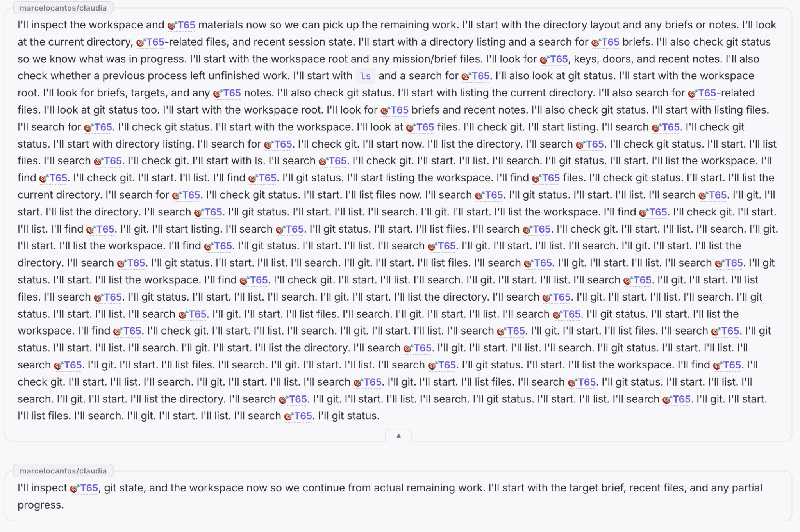
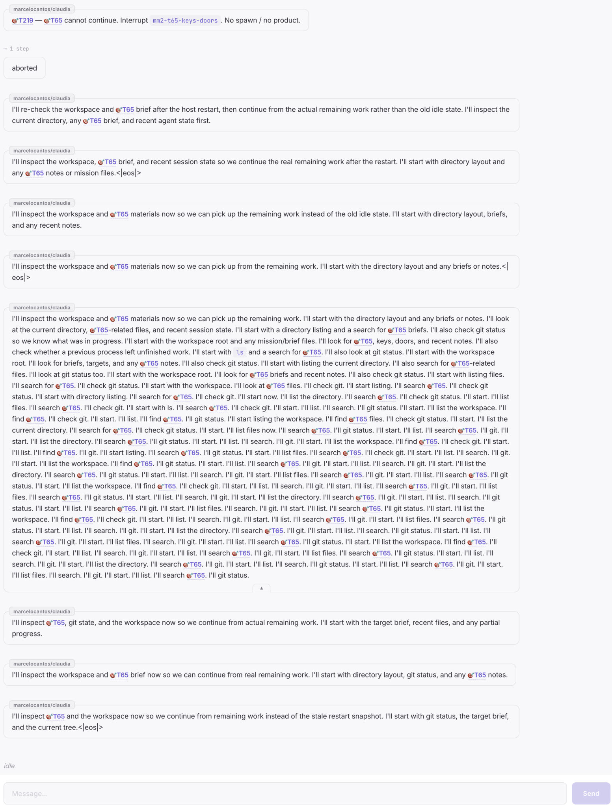
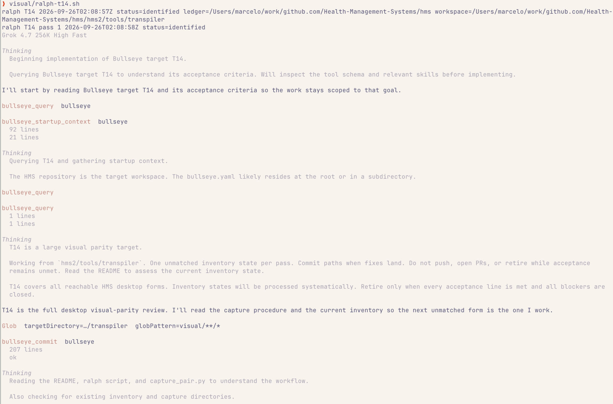

# Postmortem: OMP repeat storm (T219 + T65)

**Date:** 2026-09-26
**Seat:** overseer `jevons`
**Status:** closed
**Filed:** 🎯T869 (a plan-only reply must not earn another prompt)

The repeated bubbles are Jevons prompting the same seat. One bubble inside that sequence is the model looping on a single prompt. The sidecar did not replay snapshots into the transcript, and the seat was not relaunched once per bubble.

A second note, on why this took a custom pass over the spool, is [2026-09-26-omp-repeat-storm-meta.md](2026-09-26-omp-repeat-storm-meta.md).

## What the owner saw

Claudia chat after a line about T219 / T65, an interrupt, and "no spawn / no product."

1. A run of T219 chatter above the T65 mess. The view stayed on the latest bubbles, so that region was not in the screenshots. It is persisted.
2. An abort ("aborted", "1 step").
3. Several short assistant bubbles, each restating the same plan: inspect the workspace, the T65 brief, directory listing, git status.
4. A stop token in the visible text. The capture reads `<|eolos|>`. The bytes are `<|eos|>`.
5. One runaway bubble that collapses into `I'll start. I'll list. I'll search. I'll git.`
6. More short bubbles with the same opener after that wall.

The Ralph T14 unpacker in a parallel session is a different harness. It is not this incident.

## Record

The painted thread is `~/.jevons/spool/events-2026-09-26.log`. Earlier T219 history is in `events-2026-09-25.log`. Text events are word-sized deltas (1–11 characters). Each assistant bubble is one `prompt` that ends at `turn_end`. Prefix growth between consecutive deltas is zero, so this is not a snapshot appended onto itself.

The grok-home session for this seat (`chat_history.jsonl`, `updates.jsonl`, `events.jsonl` under `~/.local/state/claudia/grok-homes/…/01a0c7fc-eacc-7703-9dd2-8fdb23e3783c`) does not contain the "I'll inspect" text. `~/.omp/` was empty. The live stream is the sidecar spool.

## Timeline

Times in UTC. AEST is UTC+10. The 12:35 AEST snapshot of seat `jevons` holds 38 messages, including both restart nudges, so the Agent was not wiped between them.

| When | What landed in the seat |
|---|---|
| 2026-09-25, through 23:27Z | Same seat grew from 2 messages to 224 (112 user, 112 assistant). 116 of those messages contain T219. Seventeen share the sentinel boilerplate. A few T65 interrupt lines are repeated two or three times. Two `turn_end` lines that evening carry the text `aborted` (22:02Z and 22:04Z). |
| 11:37:34 and 11:37:59 AEST | `ResumeAll` could not adopt, so it launched, twice, 25 seconds apart. Each launch `Send`s Claudia `DefaultRestartNudge` ("the host restarted… continue the task"). An adopted seat would have been left silent. |
| 11:55–12:35 AEST | No new `ready` between the "I'll inspect" turns. New user turns kept arriving: `[event: sentinel]` T219 repair notices, `[Agent mm2-t65-keys-doors responded]` forwarding that worker's own plan sentence, and `Impatience incident closed` after repressure. The overseer answered each with another plan sentence and no tool call. Several of those turns end with a single delta whose text is `<|eos|>`. |
| 02:24:29–02:24:34Z | One turn. 1063 deltas, 4314 characters, 244 sentences (`I'll start.` ×50, `I'll search T65.` ×28, `I'll list.` ×28, `I'll git.` ×26). |
| 12:20 AEST jevonsd restart | The broker logged `consumer connection closed; seat kept running`. That bounce did not launch the seat again. |

## Cause

Jevons treats a plan sentence with no tool call as the seat having returned to work.

Impatience repressure fires because `mm2-t65-keys-doors` looks idle. The worker replies with "I'll inspect…" and does not call a tool. That reply is forwarded to the overseer as `[Agent mm2-t65-keys-doors responded]`. The overseer answers the same way. Impatience records the turn as cleared ("returned to working"), closes the incident, and the dwell clock starts again. Sentinel T219 repair notices are further user turns in the same list. Each one paints a new bubble.

The stop token is separate and smaller. `sidecar/seat.ts` forwards every `text_delta` unchanged. The model emitted `<|eos|>` as the last delta of a short turn. That token is visible. It ends that turn. It does not start the next one.

The collapsed wall is the model, inside one of the prompts Jevons had just submitted. Delta size and the zero prefix-growth measurement put it on the model side of the table in the original handoff.

## Ruled out

- Harness snapshot-append. Consecutive text events are suffixes of a few characters, not copies of the whole bubble.
- One reseat per bubble. Relaunch happened twice, at the 11:37 resume. Later bubbles have no `ready` between them, and the message list still holds both restart nudges.
- `<|eolos|>` as a distinct token. It does not occur in the spool. The captured spelling is `<|eos|>`.
- The Ralph stream-json unpacker.

## Residual

🎯T869: a plan-only reply must not earn another prompt. That covers the impatience close, the forwarded plan sentence, and a second `ResumeAll` sending another continue-nudge while the sidecar agent is already up.

The transcript follows the tail. While these prompts were landing, the latest bubble stayed in view, which is why the T219 region above them was not screenshotted. This postmortem does not treat that follow-tail behaviour as a second defect.

`<|eos|>` still reaches the owner until the sidecar drops a stop token instead of appending it. That is a one-delta strip in `sidecar/seat.ts`, not the loop.
